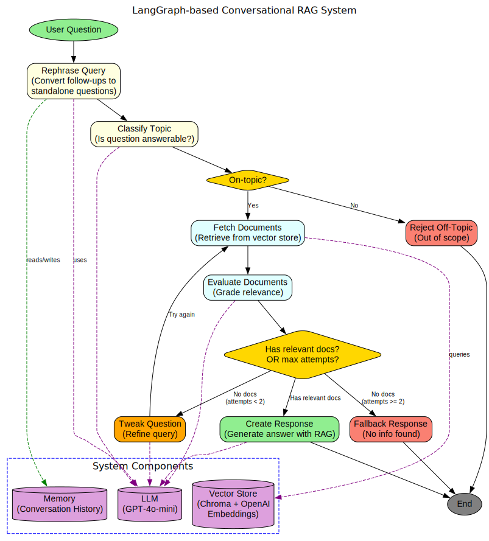

# LangGraph-based Conversational RAG System

## Overview

This guide teaches you how to build a sophisticated **Retrieval-Augmented Generation (RAG)** system using LangGraph. Unlike basic RAG implementations, this system handles:

- ✅ Multi-turn conversations with context preservation
- ✅ Intelligent filtering of irrelevant questions
- ✅ Automatic evaluation and improvement of search results
- ✅ Adaptive query optimization with retry logic
- ✅ Complete dialogue memory management

## Table of Contents

1. [What is RAG?](#what-is-rag)
2. [System Architecture](#system-architecture)
3. [Prerequisites](#prerequisites)
4. [Project Setup](#project-setup)
5. [Core Components](#core-components)
6. [Implementation Details](#implementation-details)
7. [Running the System](#running-the-system)
8. [Test Scenarios](#test-scenarios)
9. [Advanced Topics](#advanced-topics)
10. [Troubleshooting](#troubleshooting)

## What is RAG?

### The Basics

**RAG (Retrieval-Augmented Generation)** combines information retrieval with language generation:

1. **Retrieve**: Search relevant documents from a knowledge base
2. **Augment**: Add found documents as context to the AI
3. **Generate**: AI produces informed, accurate answers

### Why Use RAG?

| Problem | RAG Solution |
|---------|--------------|
| AI hallucinations | Grounds answers in real documents |
| Outdated information | Access to current knowledge base |
| No source verification | Can cite specific documents |
| Generic responses | Domain-specific accuracy |

### Key Concepts

**Embeddings**: Convert text to numerical vectors for semantic search
```
"restaurant hours" → [0.23, 0.45, -0.12, ...] 
"opening times"    → [0.24, 0.43, -0.11, ...] (similar!)
```

**Vector Database**: Stores and searches document embeddings efficiently

**LLM**: Generates human-like responses using retrieved context

## System Architecture

### Flow Diagram



```
User Question
    ↓
[Rephrase Query] ─→ Convert follow-ups to standalone
    ↓
[Classify Topic] ─→ Is it answerable?
    ├─→ No ─→ [Reject Off-Topic] ─→ END
    └─→ Yes
        ↓
[Fetch Documents] ─→ Search vector database
    ↓
[Evaluate Docs] ─→ Grade relevance
    ├─→ Found good docs? ─→ [Create Response] ─→ END
    ├─→ No docs & attempts < 2? ─→ [Tweak Question] ─→ Retry
    └─→ Max attempts? ─→ [Fallback Response] ─→ END
```

### Graph Nodes

| Node | Purpose | Example |
|------|---------|---------|
| **Rephrase Query** | Convert context-dependent questions | "Also Sunday?" → "Is Bella Vista open on Sundays?" |
| **Classify Topic** | Filter out-of-scope questions | "Weather?" → Rejected |
| **Fetch Docs** | Retrieve from vector store | Find restaurant info |
| **Evaluate Docs** | Grade relevance with LLM | Is doc helpful? Yes/No |
| **Tweak Question** | Refine for better results | "owner age" → "age of owner" |
| **Create Response** | Generate final answer | Use docs + LLM |

## Prerequisites

### Requirements

- Python >= 3.11
- OpenAI API Key ([Get one here](https://platform.openai.com))
- Basic Python knowledge
- Understanding of APIs (helpful)

### Install Dependencies

```bash
# Using uv (recommended)
uv add langchain langchain-openai langchain-community langgraph chromadb python-dotenv

# Or using pip
pip install langchain langchain-openai langchain-community langgraph chromadb python-dotenv
```

### Setup Environment

Create `.env` file:
```bash
OPENAI_API_KEY="your-api-key-here"
```

## Project Setup

### Quick Start

```bash
# 1. Create project directory
mkdir langgraph-rag && cd langgraph-rag

# 2. Initialize
uv init

# 3. Install dependencies
uv add langchain langchain-openai langchain-community langgraph chromadb python-dotenv

# 4. Create .env with your OpenAI key
echo 'OPENAI_API_KEY="your-key"' > .env

# 5. Copy the implementation code
# (langgraph_rag_system.py)

# 6. Run
uv run langgraph_rag_system.py
```

## Core Components

### 1. Document Management

```python
from langchain_core.documents import Document
from langchain_openai import OpenAIEmbeddings
from langchain_community.vectorstores import Chroma

# Create documents
docs = [
    Document(
        page_content="Bella Vista opens at 11:00 AM daily.",
        metadata={"source": "info.txt"}
    )
]

# Setup vector store
embeddings = OpenAIEmbeddings(model="text-embedding-3-small")
vectorstore = Chroma.from_documents(docs, embeddings)
retriever = vectorstore.as_retriever(search_kwargs={"k": 2})
```

### 2. State Definition

```python
from typing import List, TypedDict
from langchain_core.messages import BaseMessage, HumanMessage
from langchain_core.documents import Document

class DialogState(TypedDict):
    turns: List[BaseMessage]           # Conversation history
    retrieved_docs: List[Document]     # Retrieved documents
    topic_flag: str                    # 'Yes' or 'No'
    refined_query: str                 # Rewritten query
    ready_for_response: bool           # Has relevant docs?
    refinement_attempts: int           # Retry counter
    question: HumanMessage             # Current question
```

### 3. LLM Setup

```python
from langchain_openai import ChatOpenAI

llm = ChatOpenAI(
    model="gpt-4o-mini",
    temperature=0  # Deterministic responses
)
```

## Implementation Details

### Node 1: Rephrase Query

Converts follow-up questions using conversation history:

```python
def rephrase_query(state: DialogState) -> DialogState:
    if len(state["turns"]) > 1:
        # Use chat history to rephrase
        response = llm.invoke([
            SystemMessage("Rephrase to standalone question"),
            *state["turns"][:-1],
            HumanMessage(state["question"].content)
        ])
        state["refined_query"] = response.content.strip()
    else:
        # First question - use as-is
        state["refined_query"] = state["question"].content
    return state
```

### Node 2: Classify Topic

Uses structured output for reliable classification:

```python
from pydantic import BaseModel, Field

class TopicGrade(BaseModel):
    score: str = Field(description="'Yes' if on-topic, 'No' otherwise")

def classify_topic(state: DialogState) -> DialogState:
    structured_llm = llm.with_structured_output(TopicGrade)
    result = structured_llm.invoke([
        SystemMessage("Classify if question is about Bella Vista"),
        HumanMessage(f"Question: {state['refined_query']}")
    ])
    state["topic_flag"] = result.score
    return state
```

### Node 3: Evaluate Documents

Grades each retrieved document:

```python
class RelevanceGrade(BaseModel):
    score: str = Field(description="'Yes' if relevant")

def evaluate_docs(state: DialogState) -> DialogState:
    structured_llm = llm.with_structured_output(RelevanceGrade)
    relevant = []
    
    for doc in state["retrieved_docs"]:
        result = structured_llm.invoke([
            SystemMessage("Grade document relevance"),
            HumanMessage(f"Q: {state['refined_query']}\nDoc: {doc.page_content}")
        ])
        if result.score.lower() == "yes":
            relevant.append(doc)
    
    state["retrieved_docs"] = relevant
    state["ready_for_response"] = len(relevant) > 0
    return state
```

### Building the Graph

```python
from langgraph.graph import StateGraph, END
from langgraph.checkpoint.memory import MemorySaver

# Create graph with memory
checkpointer = MemorySaver()
workflow = StateGraph(DialogState)

# Add nodes
workflow.add_node("rephrase_query", rephrase_query)
workflow.add_node("classify_topic", classify_topic)
workflow.add_node("fetch_docs", fetch_docs)
workflow.add_node("evaluate_docs", evaluate_docs)
# ... add other nodes

# Define edges
workflow.add_edge("rephrase_query", "classify_topic")
workflow.add_conditional_edges("classify_topic", topic_router, {...})
workflow.add_conditional_edges("evaluate_docs", decision_router, {...})

# Compile
workflow.set_entry_point("rephrase_query")
graph = workflow.compile(checkpointer=checkpointer)
```

## Running the System

### Basic Usage

```python
system = RAGSystem()

# Single question
result = system.process_question(
    "When does Bella Vista open?",
    thread_id=1
)

# Access response
print(result["turns"][-1].content)
```

### Multi-Turn Conversation

```python
# Same thread_id maintains context
system.process_question("What are the prices?", thread_id=1)
system.process_question("Any cheaper options?", thread_id=1)  # Uses context
```

## Test Scenarios

### Scenario 1: Off-Topic Question

```
Input: "How is the weather?"
Result: "I can't respond to that!" ✅
```

### Scenario 2: Unanswerable Question

```
Input: "How old is the owner?"
Process:
1. Classifies as on-topic (about owner)
2. Retrieves documents
3. No relevant info found
4. Refines query twice
5. Still no relevant info
6. Returns: "I'm sorry, but I couldn't find the information" ✅
```

### Scenario 3: Follow-Up Question

```
Q1: "When does Bella Vista open?"
A1: "11:00 AM to 10:00 PM weekdays, 11:00 AM to 11:00 PM weekends"

Q2: "Also on Sunday?"
Process:
1. Rephrases to: "What are the opening hours for Bella Vista on Sundays?"
2. Retrieves and validates documents
3. Returns: "Bella Vista is open on Sundays from 11:00 AM to 11:00 PM" ✅
```

## Advanced Topics

### Custom Documents

```python
from langchain_community.document_loaders import TextLoader, PyPDFLoader

# Load from files
loader = TextLoader("data/info.txt")
docs = loader.load()

# Load PDFs
pdf_loader = PyPDFLoader("manual.pdf")
pdf_docs = pdf_loader.load()
```

### Adjust Retrieval

```python
# More documents
retriever = db.as_retriever(search_kwargs={"k": 5})

# Score threshold
retriever = db.as_retriever(
    search_kwargs={"k": 3, "score_threshold": 0.7}
)
```

### Customize LLM

```python
# More creative
llm = ChatOpenAI(model="gpt-4o-mini", temperature=0.7)

# Better quality
llm = ChatOpenAI(model="gpt-4o")
```

### Persistent Storage

```python
from langgraph.checkpoint.sqlite import SqliteSaver

checkpointer = SqliteSaver.from_conn_string("conversations.db")
graph = workflow.compile(checkpointer=checkpointer)
```

## Troubleshooting

### Common Issues

**API Key Errors**
```bash
Error: "OpenAI API key not found"
Solution: Check .env file, verify OPENAI_API_KEY name, restart session
```

**Import Errors**
```bash
Error: "ModuleNotFoundError"
Solution: uv add [package-name] or pip install [package-name]
```

**Quota Exceeded**
```bash
Error: "429 quota exceeded"
Solution: Check platform.openai.com/usage, add credits, or wait
```

**Slow Performance**
```bash
Solution: Reduce k parameter, cache embeddings, use faster models
```

## Best Practices

### Document Preparation
- ✅ Keep documents focused and concise
- ✅ Include relevant metadata
- ✅ Split long documents into chunks
- ❌ Don't mix unrelated topics

### Prompt Engineering
- ✅ Be specific in instructions
- ✅ Use structured outputs
- ✅ Test with edge cases
- ❌ Don't assume implicit understanding

### Error Handling
```python
try:
    result = system.process_question(question, thread_id)
except Exception as e:
    logging.error(f"Error: {e}")
    return {"error": str(e)}
```

## Future Enhancements

- **Multi-Source RAG**: Combine multiple knowledge bases
- **Advanced Memory**: Long-term user preferences
- **UI Development**: Web interface with Streamlit
- **Production Features**: Rate limiting, auth, analytics
- **Enhanced Evaluation**: Confidence scores, citations

## Resources

- **LangChain Docs**: [python.langchain.com](https://python.langchain.com)
- **LangGraph Guide**: [langchain-ai.github.io/langgraph](https://langchain-ai.github.io/langgraph/)
- **OpenAI Docs**: [platform.openai.com/docs](https://platform.openai.com/docs)

## Summary

You've built a production-ready conversational RAG system with:

✨ **Intelligent routing** for different question types  
✨ **Context awareness** for multi-turn conversations  
✨ **Self-correction** when initial retrieval fails  
✨ **Quality control** through document evaluation  
✨ **Graceful degradation** for edge cases  

### Key Takeaways

1. RAG improves LLM accuracy by grounding in real documents
2. LangGraph enables complex workflows through graphs
3. State management maintains conversation context
4. Evaluation prevents poor quality responses
5. Structured outputs ensure reliability

**Questions? Issues? Improvements?**  
Experiment with your own documents and customize for your domain!
